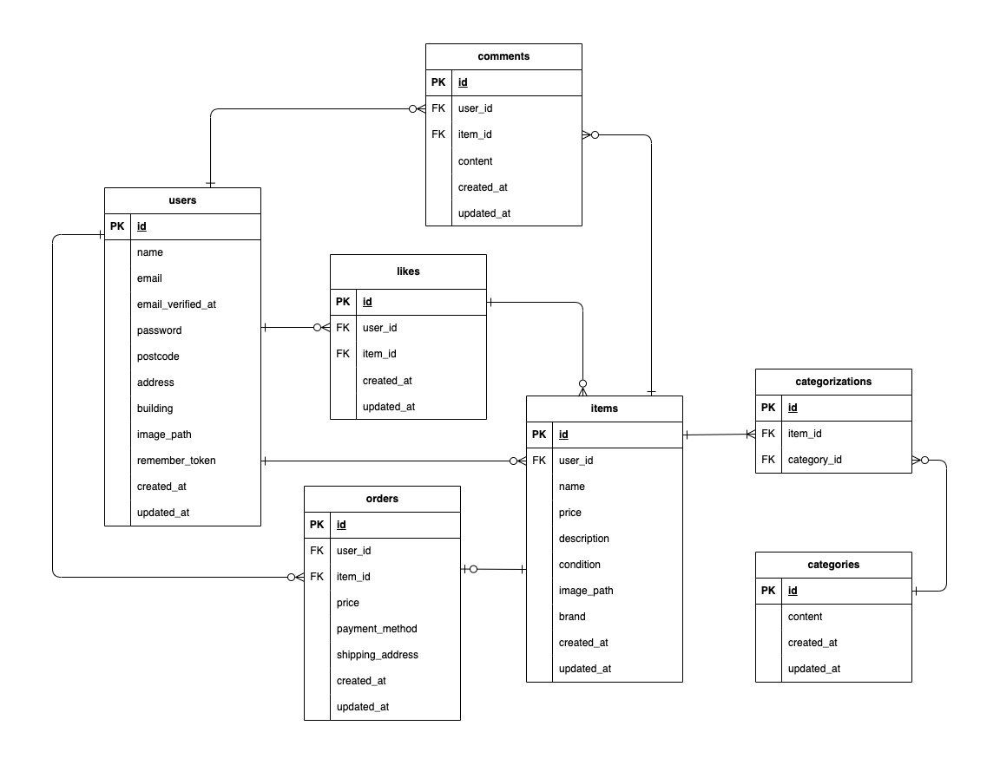

# 🛍 フリマアプリ

## 🛠 環境構築
### Dockerビルド
1. git clone git@github.com:ghshzk/furima-app.git
2. docker-compose up -d --build

### Laravel環境構築
1. docker-compose exec php bash
2. composer install
3. cp .env.example .env
4. .envファイルの環境変数を変更
```
DB_CONNECTION=mysql
DB_HOST=mysql
DB_PORT=3306
DB_DATABASE=laravel_db
DB_USERNAME=laravel_user
DB_PASSWORD=laravel_pass
```
5. php artisan key:generate
6. php artisan migrate:fresh --seed
7. php artisan storage:link

## 💻 使用技術
- Laravel 8
- PHP 7.4.9
- MySQL 8.0.26
- Nginx 1.21.1

## 📧 メール認証
メール認証機能に Mailtrap を使用しています。開発環境では以下の手順で設定を行ってください。
1. [Mailtrap](https://mailtrap.io/)に登録・ログイン、サイドバーの Inboxes から My Inbox を開く
2. Integrations で「**laravel 7.x and 8.x**」を選択し、表示されるコードをコピーして、`.env`ファイルの`MAIL`セクションにペースト
3. MAIL_FROM_ADDRESSは任意のメールアドレス、MAIL_FROM_NAMEは任意の名前を入力。
```
MAIL_MAILER=smtp
MAIL_HOST=sandbox.smtp.mailtrap.io
MAIL_PORT=2525
MAIL_USERNAME=xxxxxxxxxxxxxx
MAIL_PASSWORD=xxxxxxxxxxxxxx
MAIL_ENCRYPTION=tls
MAIL_FROM_ADDRESS="test@example.com"
MAIL_FROM_NAME="${APP_NAME}"
```

## 決済画面
決済にはStripeというツールを使用しています。  


## 🗂 テーブル仕様
usersテーブル
|カラム名          |型      |PRIMARY KEY|UNIQUE KEY|NOT NULL|FOREIGN KEY|
|-----------------|---------------|:---:|:---:|:---:|:---:|
|id               |BIGINT UNSIGNED|○    |     |○   |   |
|name             |VARCHAR(255)   |     |     |○   |   |
|email            |VARCHAR(255)   |     |○    |○   |   |
|email_verified_at|TIMESTAMP      |     |     |    |   |
|password         |VARCHAR(255)   |     |     |○   |   |
|postcode         |VARCHAR(255)   |     |     |    |   |
|address          |VARCHAR(255)   |     |     |    |   |
|building         |VARCHAR(255)   |     |     |    |   |
|image_path       |VARCHAR(255)   |     |     |    |   |
|remember_token   |VARCHAR(100)   |     |     |    |   |
|created_at       |TIMESTAMP      |     |     |    |   |
|updated_at       |TIMESTAMP      |     |     |    |   |

itemsテーブル
|カラム名    |型     |PRIMARY KEY|UNIQUE KEY|NOT NULL|FOREIGN KEY|
|-----------|---------------|:---:|:---:|:---:|:------:|
|id         |BIGINT UNSIGNED|○    |     |○   |         |
|user_id    |BIGINT UNSIGNED|     |     |○   |users(id)|
|name       |VARCHAR(255)   |     |     |○   |         |
|price      |INT            |     |     |○   |         |
|description|VARCHAR(255)   |     |     |○   |         |
|condition  |TINYINT        |     |     |○   |         |
|image_path |VARCHAR(255)   |     |     |○   |         |
|brand      |VARCHAR(255)   |     |     |    |         |
|status   |ENUM('on_sale', 'sold_out')   |     |     |○   |         |
|created_at |TIMESTAMP      |     |     |    |         |
|updated_at |TIMESTAMP      |     |     |    |         |

categoriesテーブル
|カラム名   |型    |PRIMARY KEY|UNIQUE KEY|NOT NULL|FOREIGN KEY|
|----------|---------------|:---:|:---:|:---:|:---:|
|id        |BIGINT UNSIGNED|○    |     |○   |      |
|content   |VARCHAR(255)   |     |     |○   |      |
|created_at|TIMESTAMP      |     |     |    |      |
|updated_at|TIMESTAMP      |     |     |    |      |

categorizationsテーブル
|カラム名    |型    |PRIMARY KEY|UNIQUE KEY|NOT NULL|FOREIGN KEY|
|-----------|---------------|:---:|:---:|:---:|:-----------:|
|id         |BIGINT UNSIGNED|○    |     |○   |              |
|item_id    |BIGINT UNSIGNED|     |     |○   |items(id)     |
|category_id|BIGINT UNSIGNED|     |     |○   |categories(id)|

likesテーブル
|カラム名   |型      |PRIMARY KEY|UNIQUE KEY|NOT NULL|FOREIGN KEY|
|----------|---------------|:---:|:---:|:---:|:------:|
|id        |BIGINT UNSIGNED|○    |     |○   |         |
|user_id   |BIGINT UNSIGNED|     |     |○   |users(id)|
|item_id   |BIGINT UNSIGNED|     |     |○   |items(id)|
|created_at|TIMESTAMP      |     |     |    |         |
|updated_at|TIMESTAMP      |     |     |    |         |

commentsテーブル
|カラム名   |型    |PRIMARY KEY|UNIQUE KEY|NOT NULL|FOREIGN KEY|
|----------|---------------|:---:|:---:|:---:|:------:|
|id        |BIGINT UNSIGNED|○    |     |○   |         |
|user_id   |BIGINT UNSIGNED|     |     |○   |users(id)|
|item_id   |BIGINT UNSIGNED|     |     |○   |items(id)|
|content   |TEXT           |     |     |○   |         |
|created_at|TIMESTAMP      |     |     |    |         |
|updated_at|TIMESTAMP      |     |     |    |         |

ordersテーブル
|カラム名         |型    |PRIMARY KEY|UNIQUE KEY|NOT NULL|FOREIGN KEY|
|----------------|---------------|:---:|:---:|:---:|:------:|
|id              |BIGINT UNSIGNED|○    |     |○   |         |
|buyer_id        |BIGINT UNSIGNED|     |     |○   |users(id)|
|seller_id       |BIGINT UNSIGNED|     |     |○   |users(id)|
|item_id         |BIGINT UNSIGNED|     |     |○   |items(id)|
|price           |INT            |     |     |○   |         |
|payment_method  |TINYINT        |     |     |○   |         |
|shipping_address|VARCHAR(255)   |     |     |○   |         |
|status   |ENUM('trading', 'completed) |     |     |○   |         |
|completed_at    |TIMESTAMP      |     |     |    |         |
|created_at      |TIMESTAMP      |     |     |    |         |
|updated_at      |TIMESTAMP      |     |     |    |         |

order_messagesテーブル
|カラム名    |型    |PRIMARY KEY|UNIQUE KEY|NOT NULL|FOREIGN KEY|
|-----------|---------------|:---:|:---:|:---:|:-------:|
|id         |BIGINT UNSIGNED|○    |     |○   |          |
|order_id   |BIGINT UNSIGNED|     |     |○   |orders(id)|
|sender_id  |BIGINT UNSIGNED|     |     |○   |users(id) |
|content    |TEXT           |     |     |○   |          |
|created_at |TIMESTAMP      |     |     |    |          |
|updated_at |TIMESTAMP      |     |     |    |          |

order_reviewsテーブル
|カラム名     |型    |PRIMARY KEY|UNIQUE KEY|NOT NULL|FOREIGN KEY|
|------------|----------------|:---:|:---:|:---:|:-------:|
|id          |BIGINT UNSIGNED |○    |     |○   |          |
|order_id    |BIGINT UNSIGNED |     |     |○   |orders(id)|
|reviewer_id |BIGINT UNSIGNED |     |     |○   |users(id) |
|reviewee_id |BIGINT UNSIGNED |     |     |○   |users(id) |
|rating      |TINYINT UNSIGNED|     |     |○   |          |
|created_at  |TIMESTAMP       |     |     |    |          |
|updated_at  |TIMESTAMP       |     |     |    |          |

## 🗺 ER図


## 🔑 ユーザーデータ
### ユーザー①
name: test_user2\
email: user1@example.com\
password: password

### ユーザー②
name: test_user2\
email: user2@example.com\
password: password

### ユーザー③
name: test_user3\
email: user3@example.com\
password: password

## 🌐 URL
- 開発環境：http://localhost/
- phpMyAdmin：http://localhost:8080/